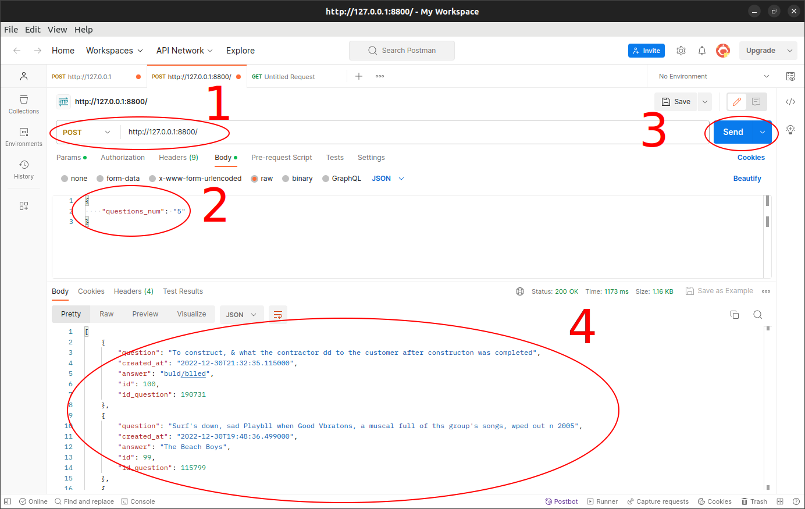
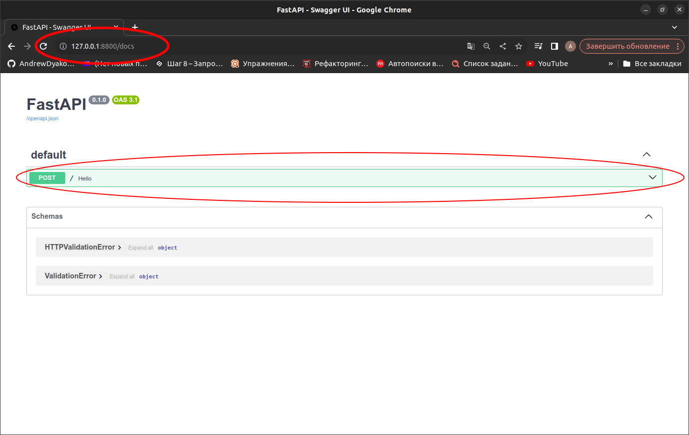
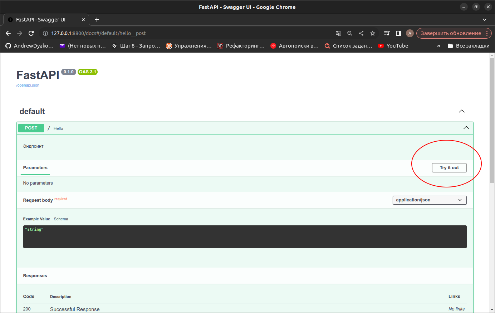
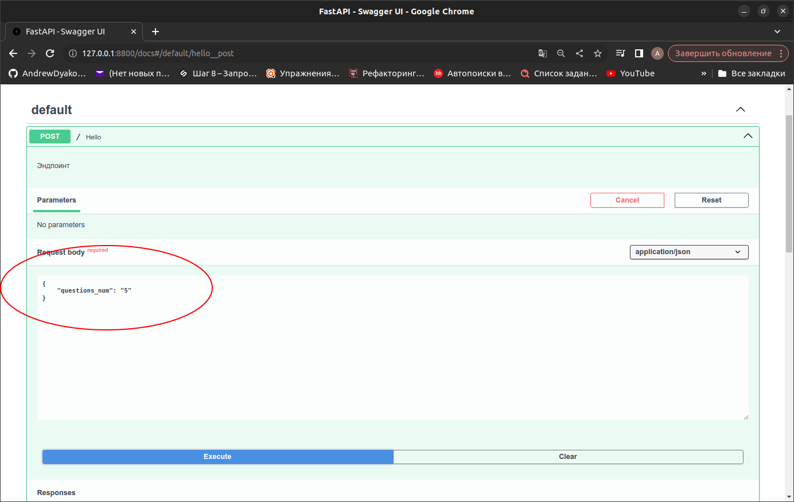
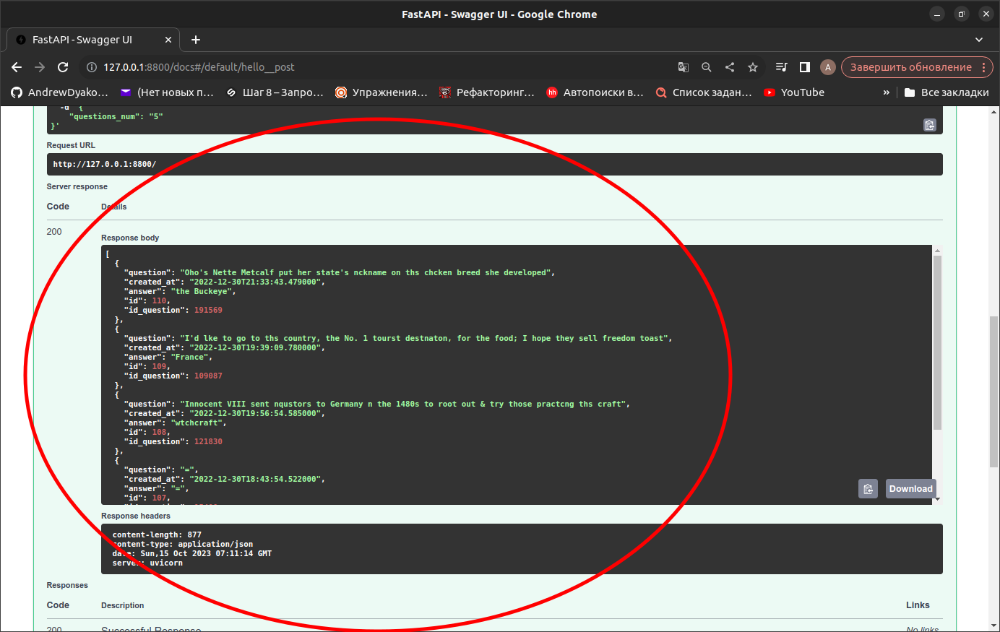

<h1 align="center">Test Work Victorina</h1>

<h2 align="center"> Тестовое задание </h2>

<div align="center">
    
<div>
    <a href="https://pypi.org/project/gunicorn/"></a>
    <a href="https://pypi.org/project/psycopg/"></a>
    <a href="https://pypi.org/project/pydantic/"></a>
    <a href="https://pypi.org/project/requests/"></a>
    <a href="https://pypi.org/project/uvicorn/"></a>
</div>
<div>
    <a href="https://www.python.org/"></a>
    <a href="https://www.postgresql.org/"></a>
    <a href="https://www.docker.com/"></a>
    <a href="https://fastapi.tiangolo.com/"></a>
    <a href="https://www.sqlalchemy.org/"></a>
</div>

</div>

___

<h2>1. Установка</h2>

1.1 Клонируйте проект:
    
```bash
    git clone git@github.com:AndrewDyakonow/TestWorkVictorina.git
```

1.2 Выполните команду построения докер образа и запуска контейнеров

```bash
    docker-compose up --build
```

и дождаться появления в терминале события:
```html
    app | [] [] [INFO] Application startup complete.
```
___

<h2>2. Работа</h2>

2.1 После запуска контейнеров, по адресу http://127.0.0.1:8800/ будет доступно приложение.

Дальнейшие действия необходимо выполнять либо в API-платформе для разработчиков ``Postman``,
либо с помощью веб-интерфейса Swagger, доступного по адресу http://127.0.0.1:8800/docs/

2.2 Для получения вопросов для викторины, необходимо в теле запроса, в атрибуте ``"questions_num"``, 
указать количество вопросов, которые мы желаем получить от сервера, например:

```html
{
    "questions_num": "5"
}
```
Ответом на запрос будет предыдущий сохранённый вопрос для викторины. При первом запросе вернётся пустой объект.

___

<h2>3. Пример </h2>

 <h3>3.1 POSTMAN </h3>



3.1.1 Вставить ссылку на эндпоинт(http://127.0.0.1:8800/) в поле ввода запроса (Номер 1)
3.1.2 В теле запроса указать параметр "questions_num", содержащий количество вопросов (Номер 2)
3.1.3 Нажать кнопку 'SEND' (Номер 3)
3.1.4 При первом запросе в сессии вернётся пустой объект, после повторного нажатия кнопки 'SEND'
будет выведен результат предыдущего запроса

<h3>3.2 Swagger </h3>

3.2.1 Вставить ссылку на эндпоинт(http://127.0.0.1:8800/) в cтроку поиска, раскрыть выпадающее меню POST запроса


3.2.2 Нажать кнопку "Try it out"


3.2.3 В поле 'Request body' ввести атрибут ``questions_num``, с указанием количества вопросов и нажать кнопку ``Execute``


3.2.4 В итоге в поле ``Server response`` будет отображён результат запроса
